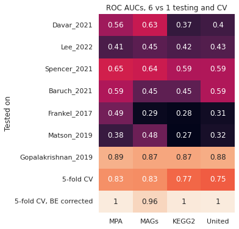
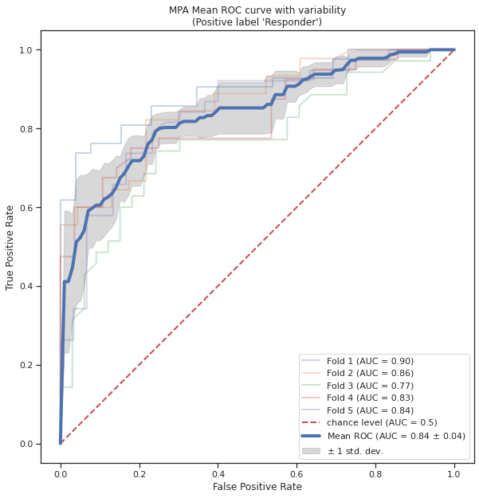
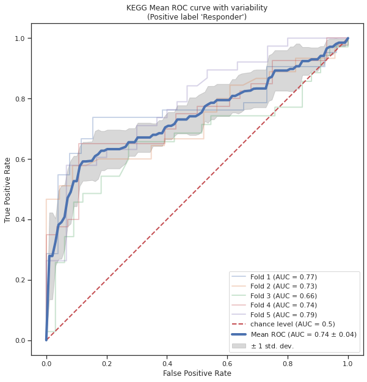
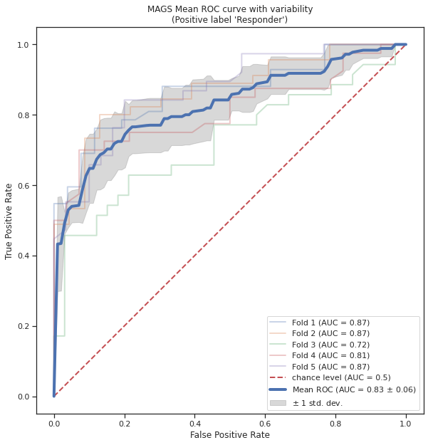
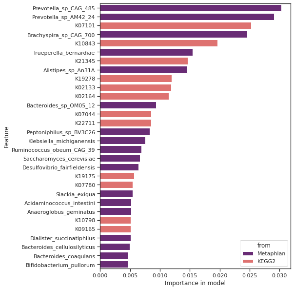
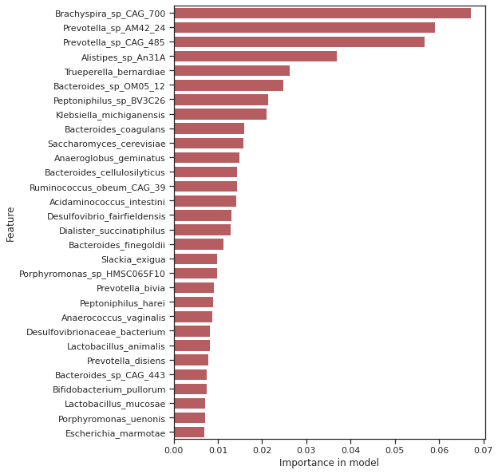
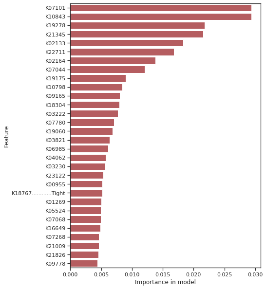
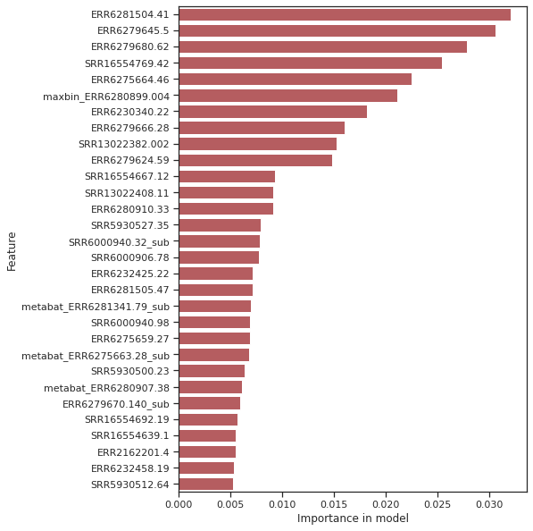
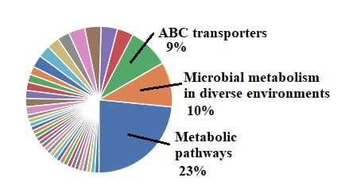
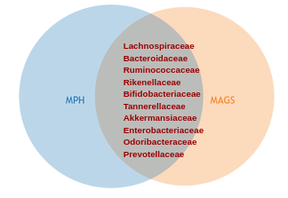

# Machine Learning in melanoma research: 
_prediction of the immunotherapy status of the patients with melanoma using their gut microbiome sequencing data._

**Students:** Tatiana Zyubko, Mikhail Filippov

**Supervisor:** Evgenii Olekhnovich
***
# Data description

We used 7 open datasets with the sequencing data from stool samples of the melanoma patients undergoing immunotherapy. Every dataset is named after the first after of the original paper.

For detailed descriptions please see original papers:
1. Lee KA, Thomas AM, Bolte LA, et al. Cross-cohort gut microbiome associations with immune checkpoint inhibitor response in advanced melanoma. Nat Med. 2022;28(3):535-544. doi:10.1038/s41591-022-01695-5
2. Spencer CN, McQuade JL, Gopalakrishnan V, et al. Dietary fiber and probiotics influence the gut microbiome and melanoma immunotherapy response. Science. 2021;374(6575):1632-1640. doi:10.1126/science.aaz7015
3. Davar D, Dzutsev AK, McCulloch JA, et al. Fecal microbiota transplant overcomes resistance to anti-PD-1 therapy in melanoma patients. Science. 2021;371(6529):595-602. doi:10.1126/science.abf3363
4. Baruch EN, Youngster I, Ben-Betzalel G, et al. Fecal microbiota transplant promotes response in immunotherapy-refractory melanoma patients. Science. 2021;371(6529):602-609. doi:10.1126/science.abb5920
5. Matson V, Fessler J, Bao R, et al. The commensal microbiome is associated with anti-PD-1 efficacy in metastatic melanoma patients. Science. 2018;359(6371):104-108. doi:10.1126/science.aao3290
6. Gopalakrishnan V, Spencer CN, Nezi L, et al. Gut microbiome modulates response to anti-PD-1 immunotherapy in melanoma patients. Science. 2018;359(6371):97-103. doi:10.1126/science.aan4236
7. Frankel AE, Coughlin LA, Kim J, et al. Metagenomic Shotgun Sequencing and Unbiased Metabolomic Profiling Identify Specific Human Gut Microbiota and Metabolites Associated with Immune Checkpoint Therapy Efficacy in Melanoma Patients. Neoplasia. 2017;19(10):848-855. doi:10.1016/j.neo.2017.08.004
***
# Repository structure
* `data` folder contains raw and preprocessed data used in research. 
    * `1_taxonomic_anotation/` - raw data from MetaPhlAn (MPA):
        * `mpa_corrected/` - tables with read counts, batch-corrected with ConQuR
            * `mpa.corrected_Dataset_name.csv`, where dataset name corresponds to the reference batch used in correction
            * ...
        * `metaphlan.tsv` - original uncorrected table from MPA
        * `mpa.nreads_unfiltered.txt` - raw table with read counts used for correction
        * `taxonomy.tsv` - taxonomy data for each MPA feature
        * `mpa.taxonomy.nreads.tsv` - same data for read counts table
    * `2_functional_annotation/` - folder with KEGG Orthology (KO) data
        * `kegg_corrected/` - batch corrected data, same as in MPA folder
        * `kegg_files/` - information about every KO feature and the KEGG pathways they mapped on
        * `humann2-KEGG.tsv` - table with KO features
    * `3_genomes/` - Metagenome-assembled-genomes (MAGs)
        * `mags_corrected/` - batch-corrected tables
        * `mags.tsv` - table with MAGs
        * `taxonomy.*` - taxonomy information for every MAG
    * `metadata.tsv` - metadata for every sample: dataset and immunotherapy status
* `results/` - folder with feature importances
    * `*_importances.csv`, where '*' refers to feature type.
    * `intersection.xlsx` - table with intersection of MAGs and MPA top 70 important features. 

    These tables contain importances from models trained on the all 7 batch-corrected datasets for every feature, e.g. corrected on 7 reference batches, and also mean importance, which were used in further analysis. MAGs importances is anotated with taxonomy. 
* `BE_correction_R` - the R script used for BE-correction with ConQuR. In order to use it, one should change 3 path variables in the begining of the script. For more information please visit ConQuR repository: https://github.com/wdl2459/ConQuR
* `Melanoma_ML_notebook.ipynb` - the jupyter notebok with the main ML pipeline. With this notebook one can generate all tables from `results/` and plots from `README`. Code is meant to be properly annotated, so please feel free to examine it.
***

# Goal of the project
...
# Methods
To examine taxonomic and functional features distinguishing people with different immunotherapy response (Rs and NRs), we used Random forest classifier (RFC). Most important features was then analyzed using literature. 

Batch correction was performed with `ConQuR` package for **R 4.3.0**.
RFC model was trained with `sklearn` package with **python 3.9**. Another python packages used in research are named in `requirements.txt`. 

Overall pipline is:
1. 
1. Batch effect correction with ConQuR
2. Model validation with corrected and uncorrected data 
3. Extraction of the importances from the models trained on batch-corrected data

# Results
### Model validation
Using uncorrected data, RFC model has demostrated acceptable accuracy with shuffle- split CV (5-fold CV row at the pic.1), but very poor results with 6-vs-1 testing (pic 1) due to severe batch-effect. To gain potentially more accurate feature importances, we performed batch effect correction with ConQuR, which evaluated accuracy up to 100% because of pre-training. This pre-training, however, still allows as to research the importance of model's features, because there is no goal to predict the immunotherapy status of the new patients. 

Next three pictures demonstrate performance of the models trained on batch-**uncorrected** data using 5-fold shuffle-split CV.

### Importances

Next step was to extract the importances, and aiming to get importances reproducible across all datasets, we used the mean importance of the feature, which is calculated from 7 importances obtained from 7 models trained on 7 datasets, batch-corrected with different reference batch. Next 4 pictures are top 30 most important features from each of united, MPA, KEGG and MAGs trained models.

United dataset: 

MPA: 

KEGG:

MAGs:

Resulting tables are available in current repository in the `results/` folder.

### Feature annotation and intersection

KEGG Orrhology annotation was not quite resultative: we are failed to link the most important KOs to any pathways important in cancer pathology.

However, reasonable result was obtained with comparsion of top 70 important MAGs and MetaPhlAn features: 29 of them was common bacteria (listed below). More details are in the table named `intersection.xlsx` in the `results/` folder.

1. Akkermansia muciniphila
2. Alistipes finegoldii
3. Alistipes indistinctus
4. Alistipes putredinis
5. Alistipes shahii
6. Bacteroides caccae
7. Bacteroides cellulosilyticus
8. Bacteroides ovatus
9. Bacteroides stercoris
10. Bacteroides thetaiotaomicron
11. Bacteroides uniformis
12. Bacteroides xylanisolvens
13. Barnesiella intestinihominis
14. Bifidobacterium longum
15. Blautia obeum
16. Blautia wexlerae
17. Dorea longicatena
18. Escherichia coli
19. Faecalibacterium prausnitzii
20. Flavonifractor plautii
21. Fusicatenibacter saccharivorans
22. Gemmiger formicilis
23. Odoribacter splanchnicus
24. Parabacteroides distasonis
25. Parabacteroides merdae
26. Roseburia intestinalis
27. Roseburia inulinivorans
28. Ruminococcus bromii
29. Ruthenibacterium lactatiformans

# Conclusion
...

